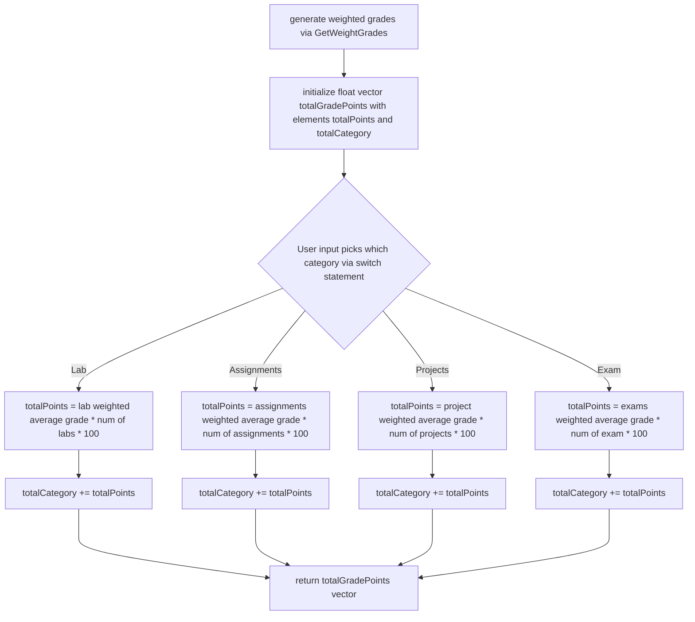
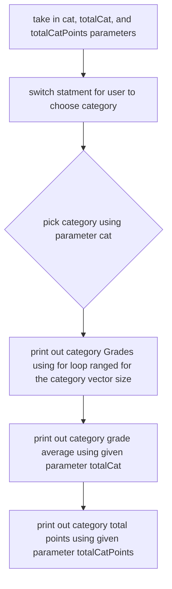
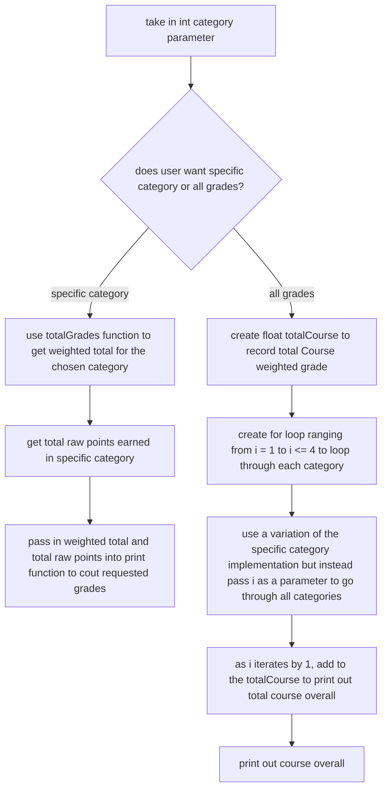

# 212 Project
Project Members: Summer Lizarda, Jonathan Ok, Joseph Quijioc, Amer al Sayari

## Summary of the Project

The premise of this project is to build a gradebook application to interpret course grades into individual grades, categorical totals and semester final grades.
More specifically, the project required our program to be able to output the grade/s in several different configurations, which were as follows:
1. Individual: returns individual deliverable name and grade
2. Category: returns all grades from category and category total
3. Course:
   * all grades in their respective categories and course overall
   * only category totals and course overall
   * only course overall
    
# Pseudocode

## main.cpp

``` 
#include "gradebook.h"
#include <iostream>
#include <string>
#include <vector>
#include <fstream>
#include <sstream>

int main(int argc, char* argv[]){
    
    //skeleton code for file input and storing the numbers
    //declare file name as argv1
    //use ifstream read data from the file
    //declare vector within a vector to hold courseGrades
    //declare a string
    
    //declare gradeCategory vector to hold grades for each category
    //use a while loop to read line by line and push back the grades into the gradeCategory vector
    //stringstream the line

    return 0;
}

```
## gradebook.cpp

```
GetWeightGrades Function
std::vector<float> Gradebook::GetWeightGrades()
//initialize a vector to hold all of the weighted grades
//check if there are grades from the input files
//for loop to iterate through list
//divide by max points that can be earned for that category and multiply by the decimal version of the max points that can be earned
//then push back into our vector to hold all of the weighted grades
//do this for all categorys

This function adds all the grades in its respective categories and return all grades in the category and gets the total for how much points can be earned
printGrades function
void Gradebook::printGrades()
//initialize a vector and call the GetWeightGrades function
//Use a for loop to loop through the grades
//Add the current grade to the total
//print the current grade while in the loop
//print total lab grade divided by max points that can be earned
//calculate the points earned for lab

Returns Total Grades For All Categorys and Course Overall
getCategorys Totals and Course Overall function
void Gradebook::getCategoryTotal(){
//initialize a total variable
//loop through the categorys
//add total and the category grades together
//initialize totalcoursegrade
//add all the categorys together
//print

```

# Flowcharts

## Program Overview

```mermaid
flowchart TD
  A[Enter data] --> B{input data};
  B --> C[User enters request];
  C --> D{is data corrrect};
  D -- Yes --> E[run program];
  D -- No --> F[ask user again];
  E ----> G[output requested Data];
  F ----> D{is data correct};
  
 ```
## getWeightedGrades() Flowchart

```mermaid
flowchart TD
    A[create empty vector for allGradesWeighted] --> B{Is the category vector empty?};
    B -- Yes --> C[end];
    B -- No --> D[enter for loop, looping for the category vector's size];
    D --> E[The weighted grade at i'th element is added to totalWeighted];
    E --> F[exit for loop];
    F --> G[push_back totalWeighted / category vector size into allGradesWeighted];
    G -- next category ----> B{Is the category vector empty?};

```

## totalGrade() Flowchart



## print() Flowchart


## printGrades() Flowchart


## Instructions on Input & Compilation

Our program takes in a file with the users sorted recorded grades.
Each line begins with the category name (i.e.) followed by the grade for Lab 1, then Lab 2, etc.
The lines should be input in the order of Labs, Assignments, Projects, and then Final.

### **Warning!**

The user must fill any currently missing grades with a 0 or the program will not properly read in and weight grades. An example of a valid data file can be read below:

```
Labs 25 19 20 21 22 23 20 17
Assignments 50 30 40 23 41
Projects 140 340
Final 87
```

# Command Line Arguments

The program's command line arguments follow the form of:

```
g++ main.cpp gradebook.cpp -o test && ./test dataset
```

where "dataset" is the name of the file with the user's data.

# Function and Method Calls

## Runtime Instructions

Running this program is rather straightforward.
After inputting the requisite command line argument with the desired file name of the grade data, users will be prompted to input integers to request particualr course grades, categorical grades, and/or individual grade(s) they wish to see.


## Example Outputs

1. A sample output of user requesting 1 individual grade, then 1 for lab, then the third lab grade:


2. A sample output of user requesting all grades and course overall:


### Contributions Table

| Name | Contribution | Started | Ended | Finished by |
| ---- | ------ | ------ | ------ | ------ |
| Summer Lizarda | pseudocode | 6/15/23 | 6/23/23 | Summer Lizarda |
| | main.cpp | 6/15/23 | 6/23/23 | Summer Lizarda |
| | getCourseTotal() | 6/22/23 | 6/23/23 | Summer Lizarda |
| | comments | 6/24/23 | 6/25/23 | Summer Lizarda |
| | optimization | 6/17/23 | 6/25/23 | Summer Lizarda |
| | totalGrade() | 6/17/23 | 6/25/23 | Summer Lizarda |
| | print() | 6/17/23 | 6/25/23 | Summer Lizarda |
| | total() | 6/17/23 | 6/25/23 | Summer Lizarda |
| Jonathan Ok | pseudocode | 6/15/23 | 6/23/23 | Jonathan Ok |
| | gradebook.cpp | 6/15/23 | 6/23/23 | Jonathan Ok |
| | getCategoryTotal() | 6/15/23 | 6/23/23 | Jonathan Ok |
| | printGrades() | 6/15/23 | 6/23/23 | Jonathan Ok |
| | GetWeightGrades() | 6/15/23 | 6/23/23 | Jonathan Ok |
| | totalGrade() | 6/17/23 | 6/25/23 | Summer Lizarda |
| | print() | 6/17/23 | 6/25/23 | Summer Lizarda |
| | total() | 6/17/23 | 6/25/23 | Summer Lizarda |
| Joseph Quijioc | pseudocode | 6/15/23 | 6/23/23 | Joseph Quijioc |
| | writing README | 6/15/23 | 6/25/23 | Joseph Quijioc |
| | Flowcharts | 6/15/23 | 6/24/23 | Joseph Quijioc |
| | printGrades() | 6/15/23 | 6/25/23 | Joseph Quijioc |
| Amer al Sayari | pseudocode | 6/15/23 | 6/23/23 | Amer al Sayari|
| | getCategoryNumber() | 6/22/23 | 6/23/23 | Amer al Sayari|
| | video | 6/23/23 | 6/23/23 | Amer al Sayari|
